# CODETREE IPCMS

A web-based **Internal Project & Client Management System (IPCMS)** built with PHP and MySQL for managing clients, projects, teams, billing, communication, and notifications.

## Overview

CODETREE IPCMS centralizes project-related operations and internal communication, with separate workflows for **Administrators and Users**, backed by a database-driven system for clients, projects, teams, invoices, messages, and notifications.

## Features

* User registration, login, and session-based authentication
* Admin dashboard
* Client, project, team, and team member management
* Billing and invoice management
* Internal communication and user messaging
* Notifications
* User profile, account settings, and password reset

## Tech Stack

| Category        | Technology                       |
| --------------- | --------------------------------- |
| Backend         | PHP                               |
| Database        | MySQL (via PDO)                   |
| Frontend        | HTML, CSS, Bootstrap, JavaScript  |
| Authentication  | PHP Sessions                      |
| Local Server    | XAMPP / Apache                    |

## Project Structure

```text
codetree-ipcms/
├── home.php
├── login.php
├── register.php
├── reset.php
├── logout.php
├── adashboard.php
├── clients.php
├── projects.php
├── teams.php
├── billing.php
├── comunication.php
├── umessages.php
├── unotification.php
├── uprofile.php
├── uprojects.php
├── settins.php
├── config.php
├── db.php
├── logo.png
├── employee.jpg
└── codetree.sql
```

## Database

Included SQL dump: `codetree.sql` → database name `codetree`

Core entities: Users, Clients, Projects, Teams, Team Members, Invoices, Messages, Notifications, Quick Messages

## Run Locally

1. **Clone the repository**
   ```bash
   git clone https://github.com/YOUR_USERNAME/codetree-ipcms.git
   cd codetree-ipcms
   ```

2. **Start XAMPP** — start Apache and MySQL.

3. **Create the database** — open `http://localhost/phpmyadmin`, create a database named `codetree`, and import `codetree.sql`.

4. **Configure the database** — update credentials in `config.php` and `db.php`:
   ```text
   Host: localhost
   Username: root
   Password: [your local password]
   Database: codetree
   ```

5. **Run the application** — place the project inside `C:\xampp\htdocs\`, then open:
   ```text
   http://localhost/codetree-ipcms/home.php
   ```

## Screenshots

### Home & Auth

| Home Page | Sign Up | Login | Reset Password |
|---|---|---|---|
| 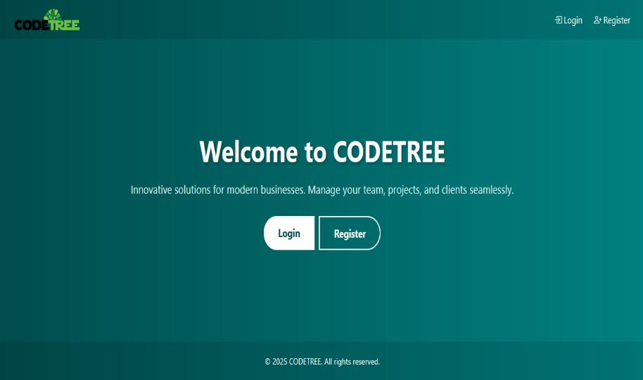 | 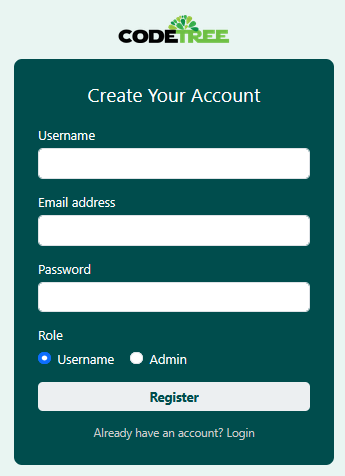 | 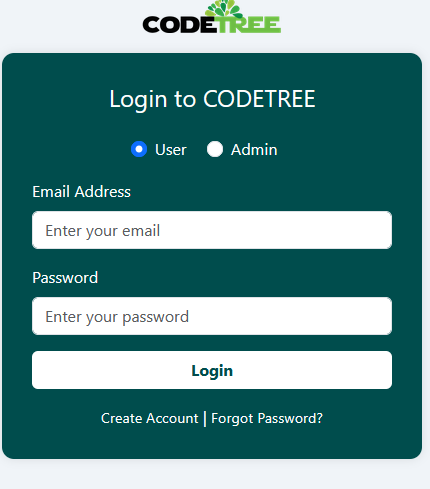 | 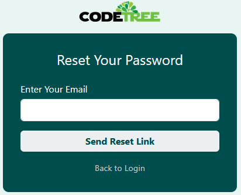 |

### Admin Dashboard

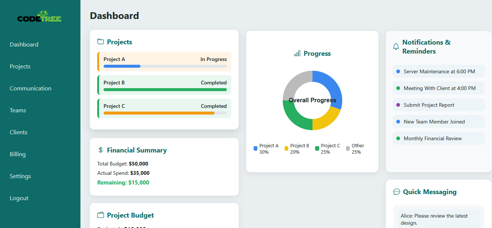

### Projects

| Projects List | Project Details |
|---|---|
| 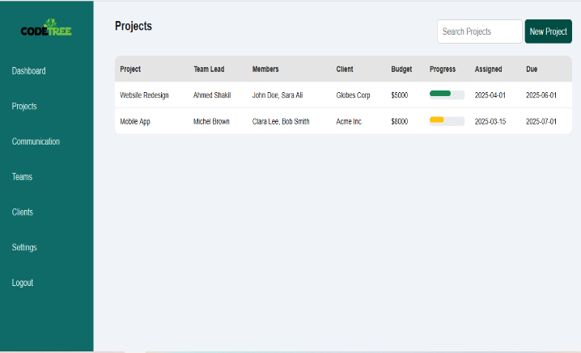 | 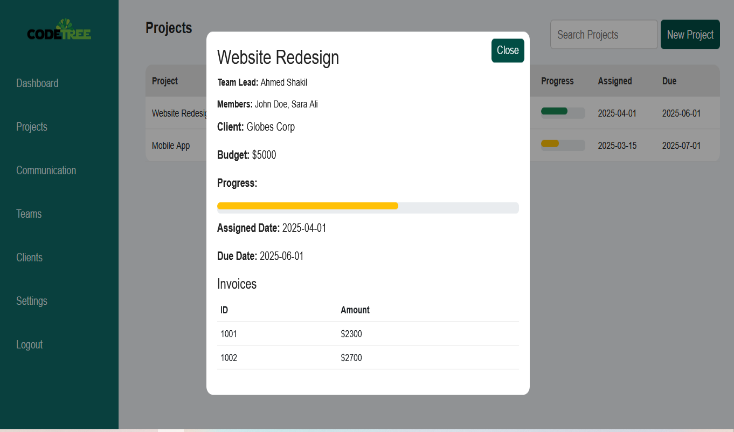 |

### Communication & Teams

| Communication | Teams |
|---|---|
| 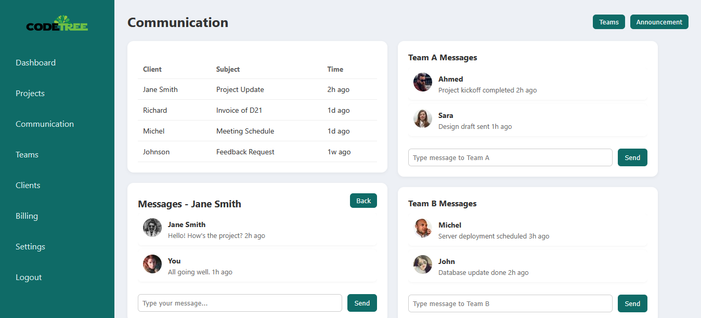 | 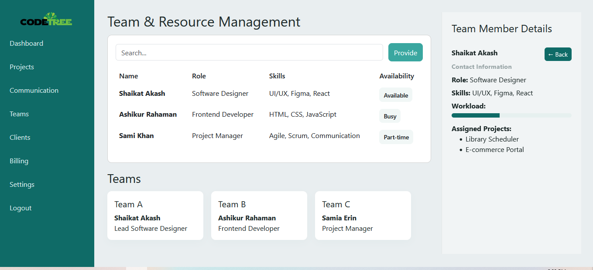 |

### Clients & Billing

| Clients | Billing |
|---|---|
| 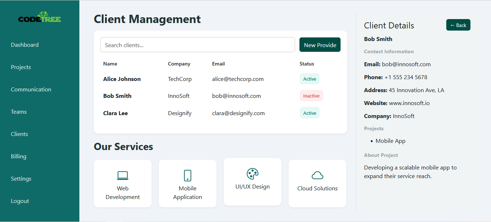 | 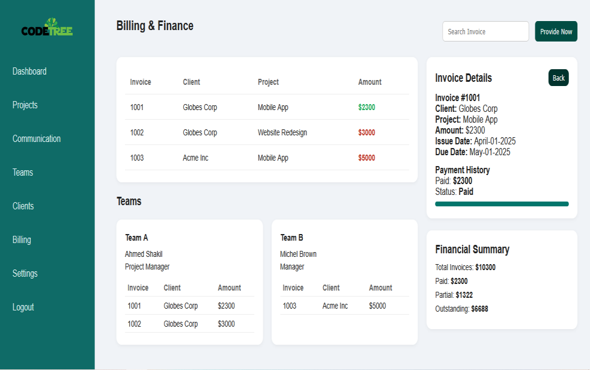 |

### Settings (Admin)

| Employees | Clients | Projects | Suppliers |
|---|---|---|---|
| 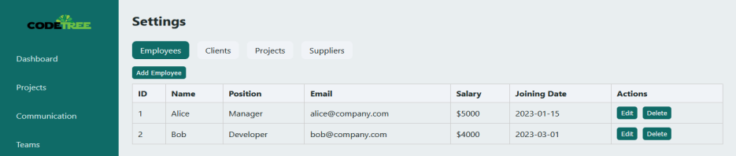 | 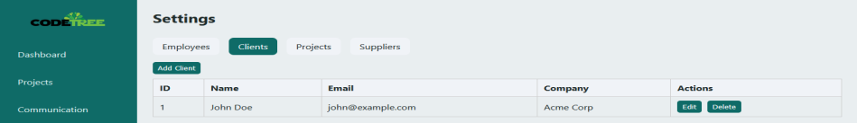 | 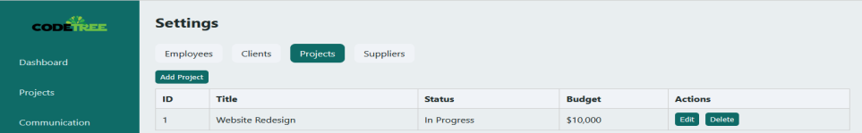 | 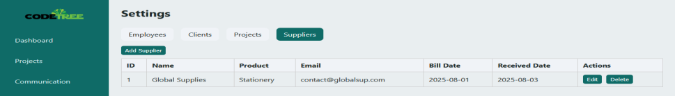 |

### User Views

| Profile | Messages | Projects | Notifications |
|---|---|---|---|
| 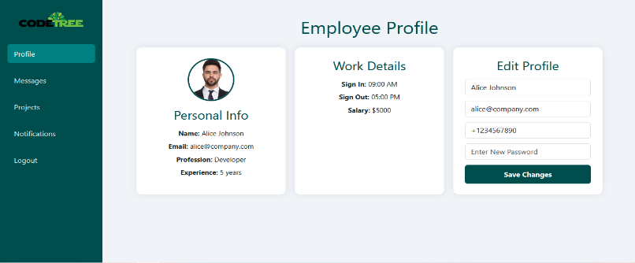 | 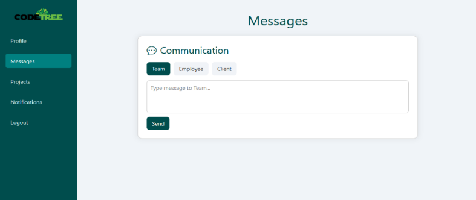 | 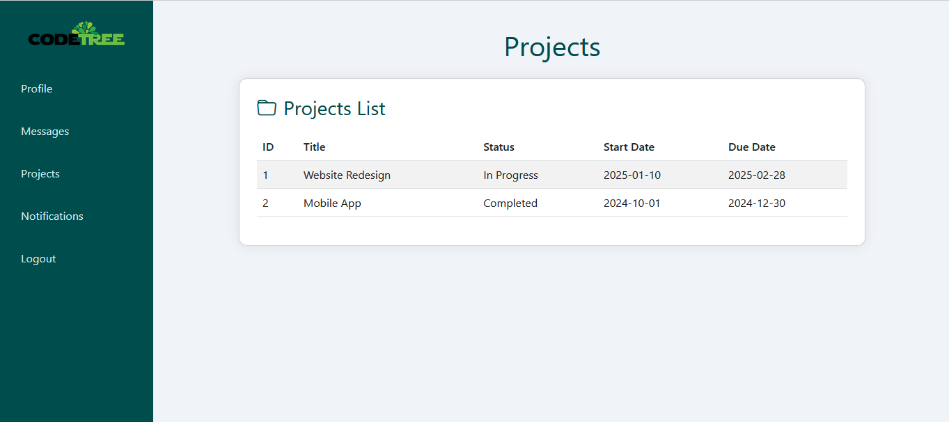 | 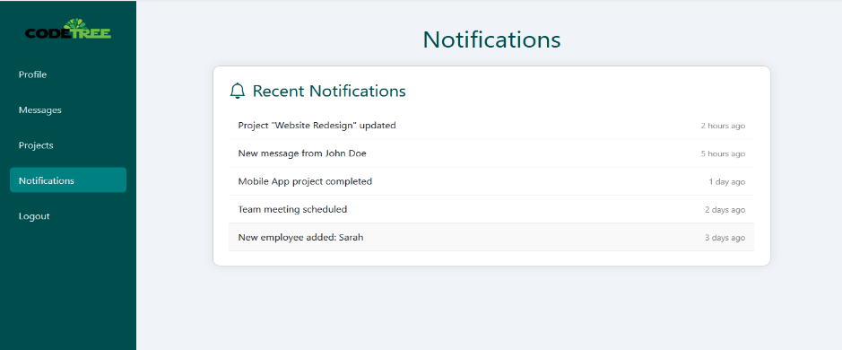 |

## Live Demo

Coming soon

## Security

Before deploying publicly:

* Do not commit production database credentials.
* Remove real client or user information from the database dump.
* Use strong passwords for all accounts and keep password hashing enabled.
* Use prepared statements for all database operations.
* Validate user input and enable HTTPS in production.
* Disable detailed database/PHP error messages on the public server.

## License

This project was developed for academic and portfolio purposes.
